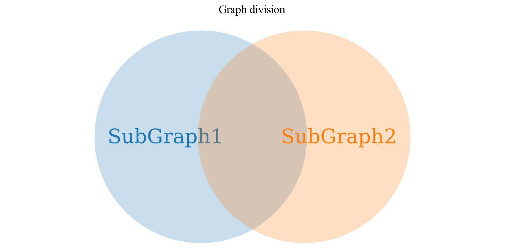
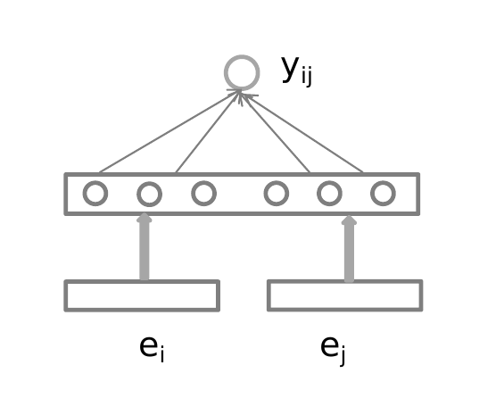

### Graph integration

ZHAO XIN

2018-08-28

---

### Catalog

- Motivation
- Task
- Model
- Experiment
- Future work

---

### Motivation

- Problem
  - Exist dependent Knowledge graphs which have same entity
  - For example, a protein can also be contained in a Drug-illness KG and a Gene KG
- After integration
  - Eliminate information redundancy
  - Integrate to larger Knowledge graph
    - Can increase knowledge with KBC

---

### Task

- Graph Division
- Train/Test Division
- Goal

---

### Task - Graph Division

- Entity set:

  $$\mathcal{E}=\mathcal{E}_1\cup\mathcal{E}_2\cup\mathcal{E}_s$$
- Relation set:

  $$\mathcal{R}=\mathcal{R}_1\cup\mathcal{R}_2\cup\mathcal{R}_s$$
- Complete Graph:

  $$\mathcal{G} : \{(e_i^h,r_i,e_i^t)|e_i^h,e_i^t\in\mathcal{E}, r_i\in\mathcal{R}\}$$
- SubGraph1:

  $$\mathcal{G1} : \{(e_i^{h1},r_i^1,e_i^{t1})|e_i^{h1},e_i^{t1}\in\mathcal{E_1}\cup\mathcal{E}_s, r_i^2\in\mathcal{R_1}\cup\mathcal{R}_s\}$$
- SubGraph2:

  $$\mathcal{G2} : \{(e_i^{h2},r_i^2,e_i^{t2})|e_i^{h2},e_i^{t2}\in\mathcal{E_2}\cup\mathcal{E}_s, r_i^2\in\mathcal{R_2}\cup\mathcal{R}_s\}$$

---

### Task - Graph Division
Show in venn graph

  

---

### Task - Train/Test Division
- Entity set divsion:

  $$\mathcal{E}_1=\mathcal{E}_1^{train}\cup\mathcal{E}_1^{test}$$

  $$\mathcal{E}_2=\mathcal{E}_2^{train}\cup\mathcal{E}_2^{test}$$

  $$\mathcal{E}_s=\mathcal{E}_s^{train}\cup\mathcal{E}_s^{test}$$

- Problem setting

  - $\mathcal{E}_1^{train}, \mathcal{E}_2^{train}, \mathcal{E}_s^{train}$ And
    $\mathcal{E}_1^{test}\cup\mathcal{E}_s^{test},\mathcal{E}_2^{test}\cup\mathcal{E}_s^{test}$ is known

  - $\mathcal{E}_1^{test}, \mathcal{E}_2^{test}, \mathcal{E}_s^{test}$ is unknown

- Task

  Identifying elements in $\mathcal{E}_1^{test}, \mathcal{E}_2^{test}, \mathcal{E}_s^{test}$

---

### Task - Graph Division
Show in venn graph

  

<!--  -->

---

### Model - Frame
说明有两个模型.
- Caculate entity embedding - **TransE**

  $$\mathcal{F}_e : e_i^1 \to E_i^1\ \ \ \ \forall e_i^1 \in \mathcal{E}_1\cup \mathcal{E}_s$$

  $$\mathcal{F}_e : e_i^2 \to E_i^2\ \ \ \ \forall e_i^2 \in \mathcal{E}_2\cup \mathcal{E}_s$$

- Use entity embedding and annotation to predict - **Shallow nerual network**

  $$\mathcal{F}\_p: \operatorname{max}p(y\_{ij}|e_i,e_j,\theta)$$

  $$e_i\in \mathcal{E}_1^{test}\cup\mathcal{E}_s^{test}$$

  $$e_j\in \mathcal{E}_2^{test}\cup\mathcal{E}_s^{test}$$

  $$y_{ij}=\begin{cases}1, \text{if $e_i=e_j$}\\\\0, \text{otherwise} \end{cases}$$

  $\theta$ : parameters of model

---

### Model - Embedding

TransE Model : Embeddings are 100 dims for each entity.

---

### Model - Shallow nerual network

- Mathematical form

  $$\mathcal{F}\_p: \operatorname{argmax}\_{\theta} p(y\_{ij}|e_i,e_j,\theta)$$

  $$e_i\in \mathcal{E}_1^{train}\cup\mathcal{E}_s^{train}$$

  $$e_j\in \mathcal{E}_2^{train}\cup\mathcal{E}_s^{train}$$

  $$y_{ij}=\begin{cases}1, \text{if $e_i,e_j\in \mathcal{E}_s^{train}$}\\\\0, \text{otherwise} \end{cases}$$

---

### Model - Shallow nerual network

- Nerual Network Model

  - Non-concatenated

  - Half-Concatenated

  - Concatenated

---

### Model - Non-concatenated

- Non-concatenated NN

  

---

### Model - Half-concatenated

- Non-concatenated NN

  - Half parameter of transpose matrix is static
  

    
  

---

### Model - Concatenated

- Concatenated NN

  

---

### Experiment

- Experiment settings

  - Several Dataset groups
    - Overlap rate (0.3, 0.4, 0.5, 0.6):

    $$\frac{|\mathcal{E}_s|}{(|\mathcal{E}_s|+|\mathcal{E}_1|)}$$
    - Train rate (0.3, 0.4, 0.5, 0.6) :

    $$\frac{|\mathcal{E}_s^{train}|+|\mathcal{E}_1^{train}|}{(|\mathcal{E}_s|+|\mathcal{E}_1|)}$$

  - Several hyper-parameter for NN model
    - Concatenated model and Unconcatenated model
    - Different hidden units (10, 30, 50)

---

### Result - concat VS unconcat

- Concatenated Models (down) VS Unconcatenated Models (up)

  

    
      
    
    
      
    
    
      
    
    
      
    
    
      
    
    
      
    
    
      
    
    
      
    
    <b>Overlap:0.3&emsp;&emsp;&emsp;&emsp;&emsp;Overlap:0.3&emsp;&emsp;&emsp;&emsp;&emsp;Overlap:0.5&emsp;&emsp;&emsp;&emsp;&emsp; Overlap:0.5</b>
     
    <b>Train:0.3&emsp;&emsp;&emsp;&emsp;&emsp;&emsp; Train:0.3&emsp;&emsp;&emsp;&emsp;&emsp;&emsp; Train:0.5&emsp;&emsp;&emsp;&emsp;&emsp;&emsp; Train:0.5</b>
  

---

### Result - Overlap30 Vs Overlap50

Train30 (up) | Train50 (down)

  

    
      
    
    
      
    
    
      
    
    
      
    
     
    <b>Overlap:0.3&emsp;&emsp;&emsp;&emsp;&emsp;&emsp;&emsp;&emsp; Overlap:0.5</b>
  

---

### Result - Train30 Vs Train50

Overlap30 (up) Vs Overlap50 (down)

  

    
      
    
    
      
    
    
      
    
    
      
    
     
    <b>Train:0.3&emsp;&emsp;&emsp;&emsp;&emsp;&emsp;&emsp;&emsp; Train:0.5</b>
  

---

### Result - With Dropout Vs Without Dropout

  

    
      
    
    
      
    
     
    <b>With Dropout&emsp;&emsp;&emsp;&emsp;&emsp;&emsp;&emsp;&emsp; Without Dropout</b>
  

---

### Result - Conclusion

- Concatenated Model > Unconcatenated Model (large effect)

- Accuracy arise with larger overlap rate (middle effect)

- Accuracy arise with larger train rate (middle effect)

- With dropout > Without dropout (small effect)

---

### Future work

- Design more reliable model

- Use the information of relation

- Anological inference
