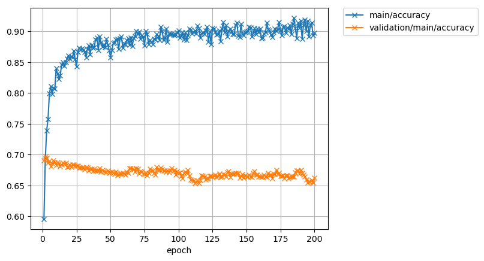
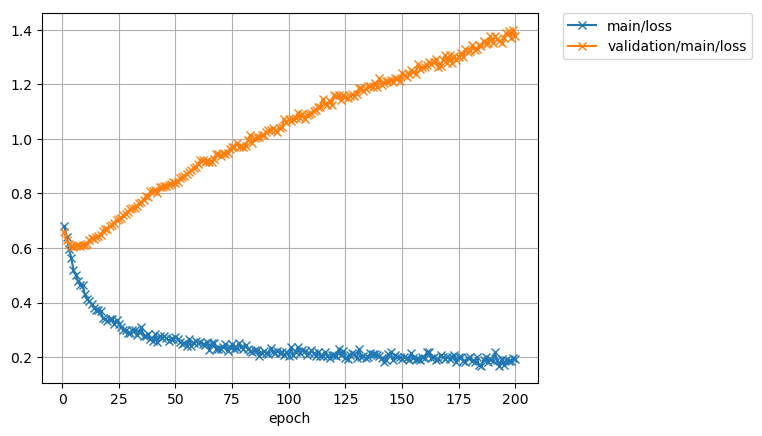

### Graph integration

ZHAO XIN

2018-09-22

---

### Catalog

- Task
- Model
- Experiment
- Result and Analysis
- Future work

---

### Task

- Graph Division
- Train/Test Division
- Goal

---

### Task - Graph Division
Show in venn graph

  

---

### Task - Graph Division

- Entity set:

  $$\mathcal{E}=\mathcal{E}_1\cup\mathcal{E}_2\cup\mathcal{E}_s$$
- Complete Graph:

  $$\mathcal{G} : \{(e_i^h,r_i,e_i^t)|e_i^h,e_i^t\in\mathcal{E}, r_i\in\mathcal{R}\}$$
- SubGraph1:

  $$\mathcal{G1} : \{(e_i^{h1},r_i^1,e_i^{t1})|e_i^{h1},e_i^{t1}\in\mathcal{E_1}\cup\mathcal{E}_s, r_i^2\in\mathcal{R_1}\cup\mathcal{R}_s\}$$
- SubGraph2:

  $$\mathcal{G2} : \{(e_i^{h2},r_i^2,e_i^{t2})|e_i^{h2},e_i^{t2}\in\mathcal{E_2}\cup\mathcal{E}_s, r_i^2\in\mathcal{R_2}\cup\mathcal{R}_s\}$$

---

### Task - Train/Test Division
Show in venn graph

  

---

### Task - Train/Test Division
- Entity set divsion:

  $$\mathcal{E}_1=\mathcal{E}_1^{train}\cup\mathcal{E}_1^{test}$$

  $$\mathcal{E}_2=\mathcal{E}_2^{train}\cup\mathcal{E}_2^{test}$$

  $$\mathcal{E}_s=\mathcal{E}_s^{train}\cup\mathcal{E}_s^{test}$$

- Problem setting

  - $\mathcal{E}_1^{train}, \mathcal{E}_2^{train}, \mathcal{E}_s^{train}$ And
    $\mathcal{E}_1^{test}\cup\mathcal{E}_s^{test},\mathcal{E}_2^{test}\cup\mathcal{E}_s^{test}$ is known

  - $\mathcal{E}_1^{test}, \mathcal{E}_2^{test}, \mathcal{E}_s^{test}$ is unknown

- Task

  Identifying elements in $\mathcal{E}_1^{test}, \mathcal{E}_2^{test}, \mathcal{E}_s^{test}$

---

### Model - Frame

**Experiment on two different frames**

- Simple Classification Models (SC)

    - Idea : A mapping from Graph 1's embedding to Graph 2's embedding
    - Weakness : Incremental pipeline model - Increasing error

- Graph neural network Models (GNN)

    - Idea : Use information propogation proccess to train a joint model

---

### Model - SC

- Train entity embedding - **TransE**

  $$\mathcal{F}_e : e_i^1 \to E_i^1\ \ \ \ \forall e_i^1 \in \mathcal{E}_1\cup \mathcal{E}_s$$

  $$\mathcal{F}_e : e_i^2 \to E_i^2\ \ \ \ \forall e_i^2 \in \mathcal{E}_2\cup \mathcal{E}_s$$

- Use entity embedding and annotation to predict - **Shallow neural network**

  $$\mathcal{F}\_p: p(y\_{ij}|e_i,e_j,\theta)$$

---

### SC - Shallow nerual network

  - Non-concatenated

  - Half-Concatenated

  - Concatenated

---

### SC - Shallow nerual network

  

    
      
    
    
      
    
    
      
    
    <b>Non-concatenated&emsp;&emsp;&emsp;&emsp;&emsp;Concatenated&emsp;&emsp;&emsp;&emsp;&emsp;Half-Concatenated</b>
     
  

---

### Shallow nerual network

- Different of parameter among three Models

- N : Dimension of node embedding

- M : Number of hidden units

  

    
      
    
  

---

### Experiment - Simple Classification Model

- Experiment settings

  - Use FB15

  - Several Dataset groups
    - Overlap rate (0.3, 0.4, 0.5, 0.6): $\frac{|\mathcal{E}_s|}{(|\mathcal{E}_s|+|\mathcal{E}_1|)}$
    - Train rate (0.3, 0.4, 0.5, 0.6): $\frac{|\mathcal{E}_s^{train}|+|\mathcal{E}_1^{train}|}{(|\mathcal{E}_s|+|\mathcal{E}_1|)}$

  - Several hyper-parameter for NN model
    - Different Classification models
    - Different hidden units (10, 30, 50)

---

### Result - Simple Classification Model

- Accuracy arise with **larger overlap rate** (middle effect)

- Accuracy arise with **larger train rate** (middle effect)

- **With dropout** > Without dropout (small effect)

- **Concatenated** Model > **Half-Concatenated** Model > **Non-concatenated** Model (large effect)

---

### Result - Concat VS Half-Concat VS Non-Concat

- Overlap rate:0.5           Train rate:0.5

  

    
      
    
    
      
    
    
      
    
    <b>Non-concatenated&emsp;&emsp;&emsp;&emsp;&emsp;&emsp;&emsp;&emsp;Half-Concatenated&emsp;&emsp;&emsp;&emsp;&emsp;&emsp;&emsp;&emsp;Concatenated</b>
  

---

### Shallow nerual network

- Different of parameter among three Models

- N : Dimension of node embedding

- M : Number of hidden units

  

    
      
    
  

---

### Analysis

- Not a mapping between two space : $\mathcal{X} \to \mathcal{Y}$

- A mapping from space-node pair :  $(\mathcal{X}, e\_i) \to (\mathcal{Y}, e\_i)$

---

### Model - Graph neural networks model

- Train embeddings - **TransE**

- Use entity embedding as **pre-trained embeddings**

- Information update with graph neural network **(Edge-static neural networks)**

- **Classification** with Shallow neural network

input(node/edge index) $\to$ GNN(Update Embedding) $\to$ Shallow neural network $\to$ 0/1 label

---

### GNN - Edge-static neural graph networks

- Insight : Update information from Adjacent nodes and edges.

- Update steps

$\rho \to \operatorname{update function}\\\$

$\rho^{e\to r}(\mathbb{r\_i}) = \mathbb{r\_i}\\\$

$\rho^{r\to e}(\mathbb{e\_i}) = \sum\_{k} F(\mathbb{e}\_{sk}, \mathbb{e}\_{rk}, \mathbb{r}\_{k}, \mathbb{e}\_{i})\\\$

---

### GNN - Edge-static neural graph networks

- Illustration of update:

  

    
      
    
      
      
    
  

---

### Experiment - Graph Neural Network Model

- Experiment settings

  - Use part of WN15 (Because training is slow)

  - Only one Dataset groups
    - Overlap rate = 0.5
    - Train rate   = 0.5

  - Several hyper-parameter for NN model

---

### Result - Graph Neural Network Model

- Failed on this Model : **Overfitting**

  

    
      
    
    
      
    
     
    <b>Accuracy&emsp;&emsp;&emsp;&emsp;&emsp;&emsp;&emsp;&emsp;&emsp;&emsp;&emsp;&emsp;&emsp;&emsp;&emsp;&emsp;&emsp;&emsp;&emsp;&emsp;Loss</b>
  

---

### Analysis - Graph Neural Network Model

- Problem : Imbalance data

  - Presume $|\mathcal{E}| = N$

  - Positive samples   :
  $$(e\_i, e_i) , e\_i\in\mathcal{E}_s\to \operatorname{positive} :|\mathcal{E}_s|\approx N$$ .

  - Negative samples :
  $$(e\_i, e_j) , e\_i\in\mathcal{E}_1\cup\mathcal{E}_s, e\_j\in\mathcal{E}_2\cup\mathcal{E}_s\to\\\ \operatorname{negative}:|\mathcal{E}_1\cup\mathcal{E}_s|\*|\mathcal{E}_2\cup\mathcal{E}_s|\approx N^2$$

  - positive/negative $\approx 1/N$

- The Problem of Problem above: Why Simple Classification Models work?

  - Conjecture : Update of GNN **changes local embedding structure** and **destroy space stability**.

---

### Analysis - Graph Neural Network Model

- Convergence of GNN is faster than SC
- Show that if have balance data, GNN may have better performance than SC.

    
      
    
    
      
    
     
    <b>SC&emsp;&emsp;&emsp;&emsp;&emsp;&emsp;&emsp;&emsp;&emsp;&emsp;&emsp;&emsp;&emsp;&emsp;&emsp;&emsp;&emsp;GNN</b>

---

### Future work

- Solve imbalance data problem
